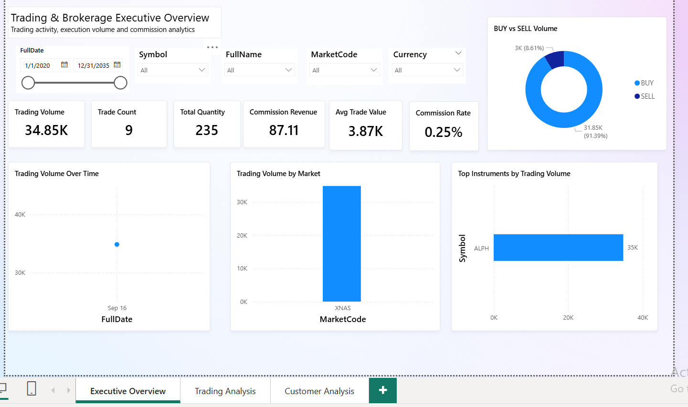
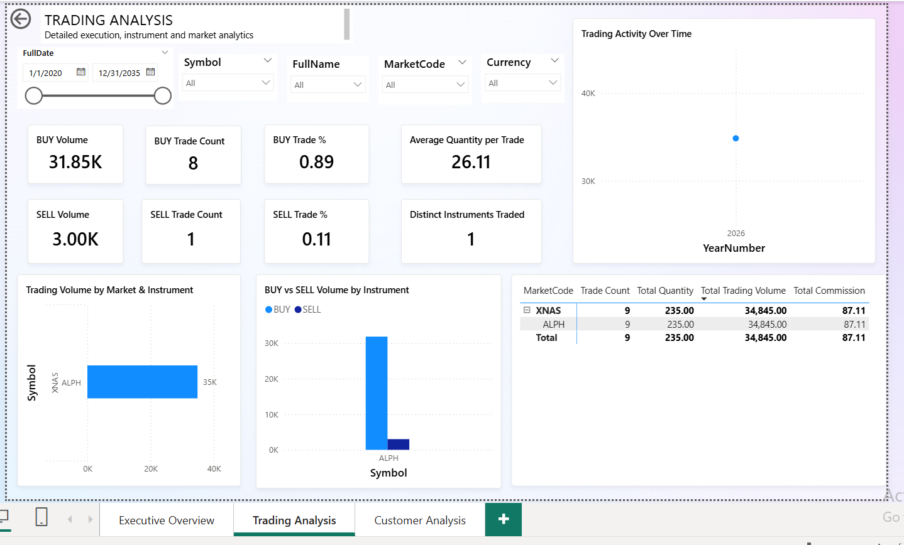
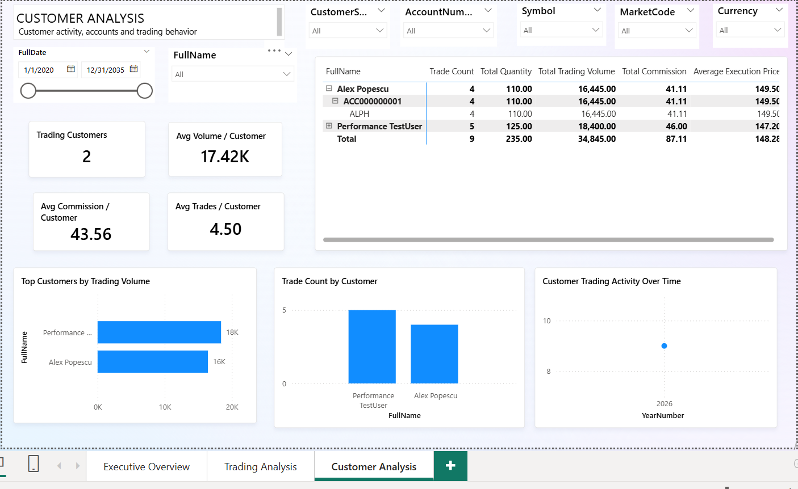
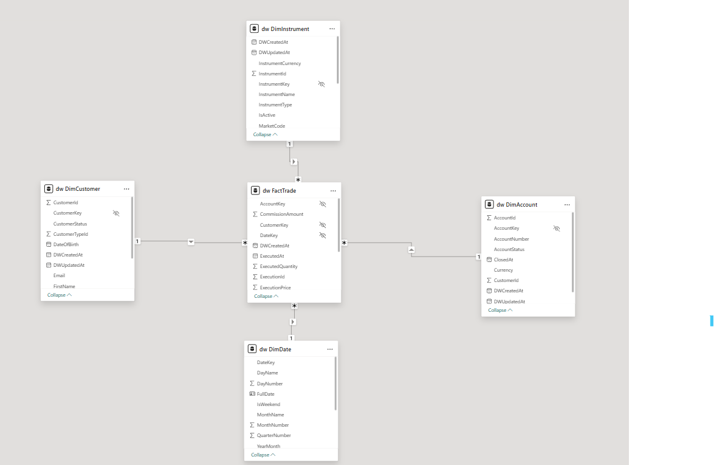

# Sistem de baze de date pentru tranzacționare și brokeraj

Proiect de portofoliu centrat pe SQL Server, care simulează platforma de back-office a unei firme de brokeraj.

Proiectul demonstrează proiectare relațională, execuție tranzacțională a ordinelor, controlul concurenței, audit, optimizarea performanței, ETL, modelare dimensională și analiză în Power BI. Scopul este prezentarea unui flux complet, de la baza operațională OLTP până la depozitul de date și raportare.

## Arhitectură

```text
BrokerageDB (OLTP)
        │
        ▼
Staging și ETL
        │
        ▼
BrokerageDW (depozit de date)
        │
        ▼
Power BI
```

`BrokerageDB` conține schemele `core`, `trading`, `audit` și `staging`. `BrokerageDW` păstrează modelul dimensional folosit pentru analiză.

## Tehnologii

- Microsoft SQL Server, T-SQL și SQL Server Management Studio
- proceduri stocate, tranzacții, `TRY/CATCH`, `THROW` și `XACT_ABORT`
- blocări, izolare și controlul concurenței
- constrângeri, triggere și istoric de audit
- indecși neclusterizați și planuri de execuție
- ETL, staging, încărcări complete și incrementale
- marcaje temporale și jurnalizarea rulărilor ETL
- modelare dimensională și schemă stea
- Power BI, DAX, Git și GitHub

## Baza de date OLTP

### Schema `core`

Conține `CustomerType`, `Customer`, `KYC`, `Account` și `CashAccount`. Un client poate avea mai multe conturi de tranzacționare, iar un cont poate avea conturi de numerar în mai multe valute.

### Schema `trading`

Conține `Market`, `Issuer`, `Instrument`, `Order`, `Execution`, `Position`, `Commission` și `CashTransaction`.

`Order` reprezintă intenția clientului, iar `Execution` reprezintă cantitatea executată efectiv. Separarea permite executarea unui ordin în mai multe tranșe.

### Schema `audit`

Conține `OrderStatusHistory`, pentru schimbările de stare ale ordinelor, și `AuditLog`, pentru operațiile asupra clienților, verificărilor KYC, conturilor, ordinelor și execuțiilor.

Integritatea datelor este protejată prin chei primare și externe, constrângeri unice, constrângeri `CHECK`, valori implicite și coloane `IDENTITY`.

## Fluxul de tranzacționare

```text
Client → KYC aprobat → Cont activ → Depozit
       → Crearea și validarea ordinului → Pending
       → Execuție → Poziție + Numerar + Comision + Audit
```

Ordinele acceptă direcțiile `BUY` și `SELL`, tipurile `MARKET` și `LIMIT`, precum și execuții parțiale sau integrale. Stările posibile sunt `Pending`, `PartiallyExecuted`, `Executed`, `Cancelled` și `Rejected`.

Ordinele se creează prin `trading.usp_CreateOrder`. Procedura validează:

- starea clientului și a contului;
- aprobarea KYC;
- existența și starea instrumentului;
- contul de numerar în valuta instrumentului;
- numerarul estimat pentru un ordin `BUY LIMIT`;
- poziția disponibilă pentru un ordin `SELL`.

## Execuția tranzacțională

`trading.usp_ExecuteOrder` verifică din nou eligibilitatea clientului și a contului în interiorul tranzacției. Apoi validează starea ordinului, cantitatea rămasă, prețul limită, numerarul sau poziția disponibilă.

Dacă validările reușesc, procedura creează execuția și comisionul, actualizează poziția și numerarul, scrie tranzacțiile de numerar și schimbă starea ordinului. Toate operațiile sunt atomice:

```sql
SET XACT_ABORT ON;
BEGIN TRY
    BEGIN TRANSACTION;
    -- operații tranzacționale
    COMMIT TRANSACTION;
END TRY
BEGIN CATCH
    IF XACT_STATE() <> 0 ROLLBACK TRANSACTION;
    THROW;
END CATCH;
```

## Concurență și execuții parțiale

Execuția folosește `UPDLOCK` și `HOLDLOCK` pentru a proteja ordinul, contul de numerar și poziția. Astfel, două sesiuni nu pot consuma independent aceeași cantitate rămasă sau același sold.

Un ordin de 100 de unități poate fi executat în tranșe de `30 @ 150`, `40 @ 149` și `30 @ 148`. Poziția rezultată folosește prețul mediu ponderat 149.

## Audit

`trading.trg_Order_StatusHistory` înregistrează numai schimbările de stare, de exemplu `Pending → PartiallyExecuted → Executed`.

Triggerele din `trg_Audit_TradingWorkflow.sql` înregistrează operațiile `INSERT`, `UPDATE` și `DELETE`, utilizatorul SQL, momentul schimbării și valorile vechi/noi în format JSON.

## Performanță

Proiectul folosește `SET STATISTICS IO ON`, `SET STATISTICS TIME ON` și planurile de execuție SQL Server. Testele au fost efectuate pe peste 100.000 de ordine.

Pentru interogarea după cont, stare și data creării, un index compus a redus citirile logice de la 1.064 la aproximativ 700 și a permis folosirea unui `Index Seek`. Detaliile sunt în [analiza performanței](docs/performance-analysis.md).

## ETL și staging

Schema `staging` izolează extragerea de sistemul operațional. Încărcarea inițială copiază datele complete, iar încărcările ulterioare folosesc marcaje temporale.

```text
UltimaÎncărcareReușită < TimpSursă <= MarcajCurent
```

`Customer`, `Account`, `Market`, `Instrument` și `Order` folosesc actualizare plus inserare. `Execution` și `CashTransaction` sunt entități numai cu adăugare, iar identificatorul sursă previne duplicatele.

`staging.ETLRunLog` păstrează începutul, finalul, starea, numărul de rânduri și eroarea. Marcajul temporal avansează numai după o tranzacție reușită.

## Depozitul de date

`BrokerageDW` folosește o schemă stea:

```text
                     DimCustomer
                          │
DimDate ───────────── FactTrade ───────────── DimInstrument
                          │
                      DimAccount
```

Dimensiunile folosesc chei surogat. Granularitatea `FactTrade` este un rând pentru fiecare execuție. Măsurile principale sunt cantitatea, prețul, valoarea tranzacției și comisionul.

Testul warehouse verifică populația dimensiunilor, reconcilierea sursă-fact, duplicatele, cheile orfane, măsurile și cheile de dată.

## Power BI

Raportul consumă modelul dimensional și conține:

- **Prezentare executivă**: volum, tranzacții, comisioane și evoluție în timp;
- **Analiza tranzacționării**: piață, instrument, sens, preț mediu și detalii;
- **Analiza clienților**: activitate, volum și detaliere client-cont-instrument.









Fișierul `.pbix` nu este versionat, deoarece `.gitignore` exclude fișierele binare Power BI. Modelul actual nu face conversie valutară, deci totalurile între valute trebuie filtrate și interpretate corespunzător.

## Testare

Scripturile din `tests/` acoperă datele inițiale, depunerile, ordinele, execuțiile, performanța, revenirea tranzacțiilor, concurența, execuția dublă, execuțiile parțiale, vânzările, constrângerile, auditul, eșecul ETL, depozitul de date și fluxul complet.

Testele de concurență necesită două sesiuni SQL Server separate.

## Structură

```text
trading-brokerage-system/
├── database/   # OLTP, proceduri, triggere, vizualizări și indecși
├── etl/        # staging și încărcări incrementale
├── warehouse/  # schema stea și încărcările analitice
├── tests/      # scenarii și validări automate
├── docs/       # arhitectură și performanță
└── powerbi/    # documentație și capturi
```

## Rularea proiectului

### 1. Baza OLTP

```text
database/01_create_database_schemas_tables.sql
database/02_seed_data.sql
database/03_seed_diverse_demo_data.sql
```

Scriptul `03_seed_diverse_demo_data.sql` este opțional și adaugă un set extins, divers și idempotent de date demonstrative. Înaintea lui, rulați scripturile din `database/procedures` și `database/triggers`. Apoi rulați scripturile din `database/views` și `database/indexes`.

### 2. Staging și ETL

```text
etl/01_create_staging.sql
etl/02_initial_load.sql
etl/03_create_etl_control.sql
etl/04_incremental_dimensions.sql
etl/04_incremental_load.sql
etl/05_incremental_append_only.sql
etl/06_refresh_staging_from_oltp.sql
```

Folosiți `06_refresh_staging_from_oltp.sql` când doriți să reconstruiți complet zona de staging din baza OLTP curentă.

### 3. Depozitul de date

```text
warehouse/01_create_warehouse.sql
warehouse/02_create_dimensions.sql
warehouse/03_create_facts.sql
warehouse/04_load_dimensions.sql
warehouse/05_load_fact_trade.sql
warehouse/06_create_analytics_indexes.sql
```

### 4. Validare

Rulați testele OLTP relevante, apoi `tests/14_data_warehouse_validation.sql` și `tests/15_end_to_end_workflow.sql`.

## Extensii viitoare

- dimensiuni cu istoric SCD 2;
- cursuri valutare și valută standard de raportare;
- SQL Server Change Tracking sau CDC;
- tabel de fapte pentru tranzacțiile de numerar;
- orchestrare ETL și CI/CD;
- API ASP.NET Core, analiză Python și publicare în Azure.

## Obiectiv

Proiectul arată cum componentele unei platforme de date financiare lucrează împreună: sistem tranzacțional, logică sigură la concurență, audit, optimizare, ETL, depozit de date și analiză Power BI.
